# PXT SMART INFRASTRUCTURE ENGINE — PUBLIC CONNECTIVITY REMEDIATION REPORT

**Platform:** PXT Smart Infrastructure SCADA & IoT Digital Twin Engine  
**Version:** 1.2.0 (Production Connectivity & Public Telemetry Remediation)  
**Date:** October 2026  
**Status:** Remediated & Fully Verified  

---

## 1. Executive Summary & Root-Cause Analysis

### Problem Statement
The production dashboard was deployed and publicly accessible via static hosting (e.g. Vercel/Netlify), but visitors observed:
- Continuous `WS RECONNECTING` state badge.
- `0%` Infrastructure Availability.
- `0/25` Online Virtual Nodes.
- Hardcoded status text reading: `| Local Twin Simulation Engine Connected to localhost:1883`.

### Root Cause Diagnosis

```
+-------------------------------------------------------------------------------------------------------+
|                                           CRITICAL ROOT CAUSES                                        |
+-------------------------------------------------------------------------------------------------------+
| 1. Client-Side Execution Context & Origin Misalignment:                                               |
|    When the React SPA is hosted on static CDN hosting (e.g., https://pxt-dashboard.vercel.app),       |
|    window.location.host points to the static host. Without VITE_API_BASE_URL set, REST requests hit  |
|    the static host (returning 404 HTML), and WebSocket attempts to connect to wss://<static-host>/ws.|
|                                                                                                       |
| 2. Erroneous Localhost Fallback for Remote Visitors:                                                  |
|    When fallback to 127.0.0.1:8000 occurred in production, external visitors' browsers attempted    |
|    to reach http://127.0.0.1:8000 on their OWN personal computers, where no backend was running.     |
|                                                                                                       |
| 3. Raw TCP MQTT Socket Incompatibility in Web Browsers:                                               |
|    Web browsers cannot initiate raw TCP sockets (port 1883). Telemetry streaming to web clients must  |
|    occur over standard WebSockets (WSS port 443 / 8000 / 9001).                                       |
|                                                                                                       |
| 4. Static Hardcoded Strings in Presentation Layer:                                                    |
|    Overview.tsx and Topology.tsx contained hardcoded strings ("localhost:1883", "127.0.0.1:8000")     |
|    rather than dynamic reflection of live backend metadata.                                           |
|                                                                                                       |
| 5. Binary State Management & Infinite Reconnection Loop:                                             |
|    The frontend only tracked a boolean wsConnected flag and lacked a robust 5-state connection       |
|    machine (CONNECTING, CONNECTED, DEGRADED, RECONNECTING, OFFLINE), bounded retries, or backoff.     |
+-------------------------------------------------------------------------------------------------------+
```

---

## 2. Remediated Architecture Diagram

```mermaid
flowchart TD
    subgraph ClientTier["Public Visitors / Web Clients (No Local Software Required)"]
        Browser["React 18 + TS SCADA Dashboard<br/>(Hosted on Vercel / Netlify / CDN)"]
        ConnMgr["Connection State Manager<br/>(5 States | Exponential Backoff | Dynamic Resolver)"]
        ConnModal["Network Settings & Diagnostics Modal<br/>(Live Ping | Custom URL Switcher)"]
        Browser --- ConnMgr
        Browser --- ConnModal
    end

    subgraph BackendTier["Public Cloud / Container Infrastructure (Render / Railway / VPS)"]
        FastAPI["FastAPI Processing Engine Core<br/>Port 8000 (HTTPS REST & WSS /ws)"]
        HealthWatcher["Heartbeat Watcher<br/>(2s Ticking | 10s Timeout)"]
        RuleEngine["Dynamic Automation Engine<br/>(Thresholds & Alerts)"]
        SQLiteDB[("SQLite Persistence DB<br/>pxt_iot.db / SQLAlchemy")]
        IngestService["Async MQTT Ingestion Service<br/>(paho-mqtt)"]

        FastAPI --> SQLiteDB
        FastAPI --> HealthWatcher
        FastAPI --> RuleEngine
        IngestService --> FastAPI
    end

    subgraph MessagingTier["MQTT Messaging Middleware"]
        Broker["amqtt Embedded / Mosquitto Broker<br/>TCP Port 1883 & WS Port 9001"]
    end

    subgraph SimulationTier["Autonomous Digital Twin Tier"]
        SimSuite["25 Autonomous Virtual Devices<br/>(5 Sectors: Grid, Water, HVAC, Industrial, Env)"]
        MathModels["Physical Sensor State Models<br/>(Thermal Inertia, Noise, Power Curves, Anomaly Injection)"]
        SimSuite --- MathModels
    end

    subgraph PhysicalHardwareTier["Field Physical IoT Hardware (Optional Mode B)"]
        ESP32["ESP32 / Microcontrollers<br/>(POST /api/telemetry/ingest)"]
        ModbusPLC["Industrial Modbus TCP PLCs<br/>(Register Polling)"]
        Gateways["Physical Field Gateways<br/>(MQTT TCP 1883)"]
    end

    Browser -- "HTTPS REST API (/api/devices, /api/health, /api/config)" --> FastAPI
    Browser -- "Secure WebSockets (WSS /ws)" --> FastAPI
    SimSuite -- "MQTT Publish & Command Subscribe (TCP 1883)" --> Broker
    IngestService -- "MQTT Subscribe pxt/# (TCP 1883)" --> Broker
    Gateways -- "MQTT Publish pxt/telemetry/# (TCP 1883)" --> Broker
    ESP32 -- "HTTP REST Ingestion" --> FastAPI
    ModbusPLC -- "Modbus Ingest" --> FastAPI
```



---

## 3. Dynamic Configuration Resolution & Connection State Machine

### 3.1 Endpoint Resolution Priority Hierarchy
The frontend automatically resolves target endpoints without requiring code rebuilds:

1. **URL Query Override**: `?api=https://your-api.com&ws=wss://your-api.com/ws` (Instant sharing/testing from any mobile or desktop device).
2. **User LocalStorage Custom Endpoint**: Configured directly in the in-app *Connection Settings Modal*.
3. **Build-Time Vite Environment Variable**: `import.meta.env.VITE_API_BASE_URL` and `VITE_WS_BASE_URL`.
4. **Origin Fallback**: Current `window.location.host` (supports reverse proxy & container setups).
5. **Local Development Fallback**: `http://127.0.0.1:8000` — **only active if `hostname === 'localhost'` or `127.0.0.1`**.

> [!IMPORTANT]
> The production frontend will **never** attempt to connect to a visitor's localhost or private loopback address when deployed to a public domain.

### 3.2 Standard 5-State Connection Machine

| State | Condition | UI Indicator | Automatic Action |
|---|---|---|---|
| **`CONNECTING`** | Initial handshake or manual reconnect triggered | Cyan spinner + `CONNECTING` | Dispatches timeout watchdog (6000ms). |
| **`CONNECTED`** | Both REST API and WebSocket stream active | Emerald pulse + `LIVE (WSS)` | Resets retry budget to 0; syncs every 5s. |
| **`DEGRADED`** | REST API active, but WebSocket stream reconnecting (or vice-versa) | Amber warning + `DEGRADED` | REST polling continues while WS retries. |
| **`RECONNECTING`** | Transport dropped; retry attempt $\le 5$ | Amber spinner + `RETRYING (N/5)` | Executes exponential backoff with jitter. |
| **`OFFLINE`** | Maximum retry budget exceeded or host unreachable | Red alert + `OFFLINE (RETRY)` | Pauses polling; prompts with Connection Modal. |

### 3.3 Bounded Retries & Exponential Backoff Formula
$$\text{Delay}(n) = \min\left(20000\text{ ms},\, 1000\text{ ms} \times 1.5^{\min(n, 8)}\right) + \text{Random}(0, 500\text{ ms})$$

---

## 4. Capability Matrix: Simulated vs Physical IoT Hardware

| Capability Area | Simulated (Virtual Digital Twin) | Physical IoT Hardware (Mode B) |
|---|---|---|
| **Device Population** | 25 autonomous virtual Python device processes. | Unlimited physical nodes (microcontrollers, PLCs, gateways). |
| **Physical Sensor Noise** | Gaussian noise, diurnal solar cycles, fluid flow models, thermal drift. | Real ADC physical sensor readings (thermocouples, RTDs, 4-20mA). |
| **Transport Protocols** | MQTT v3.1.1 (TCP 1883 / WS 9001), WebSockets. | MQTT TCP 1883, HTTP/REST (`/api/telemetry/ingest`), Modbus TCP. |
| **Anomaly Injection** | Instant software setpoint spike & fault trigger. | Real-world hardware faults & physical boundary exceptions. |
| **Bidirectional Commands** | Simulated power relays, motor setpoints, valve throttles. | Real GPIO switching, industrial relay coils, PWM drive control. |
| **Telemetry Persistence** | SQLite (`pxt_iot.db`) with 30-day automated retention. | SQLite or PostgreSQL time-series database. |
| **Public User Access** | Zero software install required — 100% in-browser. | Zero software install required for dashboard viewers. |

---

## 5. Deployment Instructions & Environment Variables

### 5.1 Environment Variable Reference

| Variable | Description | Default (Local) | Production Example |
|---|---|---|---|
| `HOST` | Backend HTTP bind interface | `127.0.0.1` | `0.0.0.0` |
| `PORT` | Backend HTTP bind port | `8000` | `8000` (or `$PORT`) |
| `MQTT_BIND_HOST` | MQTT Broker listen address | `0.0.0.0` | `0.0.0.0` |
| `MQTT_HOST` | MQTT Broker hostname for backend/sim | `127.0.0.1` | `mqtt-broker` (Docker) or `127.0.0.1` |
| `MQTT_PORT` | MQTT Broker TCP port | `1883` | `1883` |
| `MQTT_WS_PORT` | MQTT Broker WebSocket port | `9001` | `9001` |
| `ALLOWED_ORIGINS` | Permitted CORS frontend origins | `*` | `https://pxt-smart-infrastructure.vercel.app` |
| `ENVIRONMENT` | System environment label | `development` | `production` |
| `DATABASE_URL` | SQLAlchemy async connection URI | `sqlite+aiosqlite:///./pxt_iot.db` | `sqlite+aiosqlite:////app/pxt_iot.db` |
| `VITE_API_BASE_URL` | Public backend URL for frontend build | *(Unset / Auto)* | `https://pxt-backend.onrender.com` |
| `VITE_WS_BASE_URL` | Public WebSocket URL for frontend build | *(Unset / Auto)* | `wss://pxt-backend.onrender.com/ws` |

### 5.2 Public Cloud Deployment Walkthrough

#### Option A: Docker Compose (Unified Stack)
```bash
git clone https://github.com/PXTsec26-xc/pxt-smart-infrastructure-engine.git
cd pxt-smart-infrastructure-engine
docker-compose up --build -d
```

#### Option B: Decoupled Cloud Deployment (Vercel Frontend + Render Backend)
1. **Backend & Broker (Render / Railway / Fly.io)**:
   - Deploy Dockerfile `Dockerfile.backend` with environment variables: `ALLOWED_ORIGINS=*`, `ENVIRONMENT=production`.
   - Backend exposes port `8000` with public HTTPS & WSS URL: `https://pxt-backend.onrender.com`.
2. **Frontend (Vercel / Netlify)**:
   - Connect repository root `/frontend`.
   - Set Build Environment Variable:
     - `VITE_API_BASE_URL` = `https://pxt-backend.onrender.com`
     - `VITE_WS_BASE_URL` = `wss://pxt-backend.onrender.com/ws`
   - Deploy. The frontend connects instantly with `LIVE (WSS)` status and 100% availability.

---

## 6. Automated Test & Build Verification Results

### Test Suite Execution Summary
- **Test Runner:** `python run_tests.py` (pytest v8.x / Python 3.13)
- **Total Tests Executed:** 11 / 11
- **Pass Rate:** **100% (11 Passed, 0 Failed)**
- **Total Duration:** 35.41s

```
================================== TEST RESULTS ==================================
tests/test_e2e.py::test_a_device_telemetry_flow ......................... PASSED
tests/test_e2e.py::test_b_device_command_and_ack_flow ................... PASSED
tests/test_e2e.py::test_c_device_failure_detection ...................... PASSED
tests/test_e2e.py::test_d_device_recovery_detection .................... PASSED
tests/test_e2e.py::test_e_automation_rule_execution .................... PASSED
tests/test_e2e.py::test_f_data_persistence_across_restarts .............. PASSED
tests/test_e2e.py::test_g_security_and_auth_controls .................. PASSED
tests/test_e2e.py::test_h_runtime_stability_and_resources .............. PASSED
tests/test_e2e.py::test_i_public_config_endpoint ....................... PASSED
tests/test_e2e.py::test_j_cors_and_security_headers .................... PASSED
tests/test_e2e.py::test_k_diagnostics_endpoint ......................... PASSED
============================= 11 passed in 35.41s =============================
```

### Frontend Production Build Verification
```
> tsc && vite build
✓ 2281 modules transformed.
dist/index.html                   0.56 kB │ gzip:   0.39 kB
dist/assets/index-CX4KPxdr.css   29.87 kB │ gzip:   5.95 kB
dist/assets/index-5aoPQFTh.js   631.73 kB │ gzip: 174.62 kB
✓ built in 9.15s (0 TypeScript errors)
```
